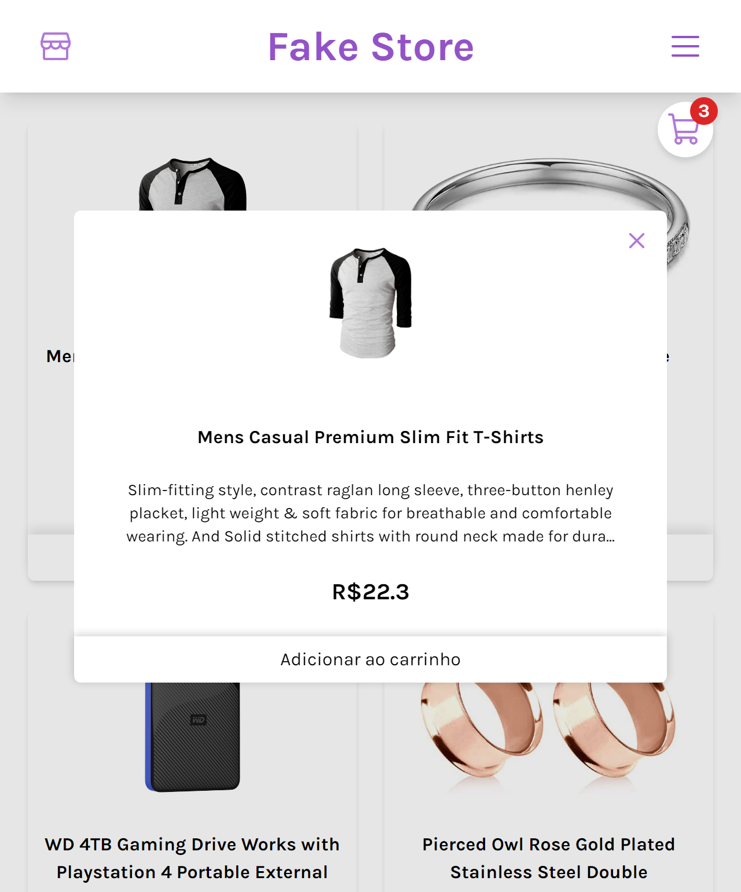

# Fake Store

Projeto criado do zero a partir da API: <a href="https://fakestoreapi.com/">Fake Store API</a>, de um e-commerce com menu de categorias, modal para descrição dos items e carrinho para finalizar a compra.

## Screenshots

## Links

Link: https://fake-store-self.vercel.app/

## Aprendizados

Treino de consumo de API, uso de ContextAPI, criação de modais, manipulação de array/states e responsividade com Tailwind.

## Construído com

-   React
-   Tailwind
-   Phosphor

## Autores

-   [@Mveryy](https://github.com/Mveryy)
